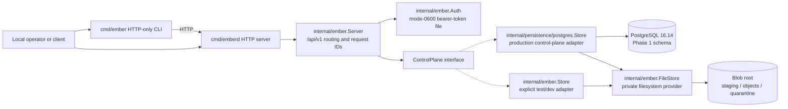
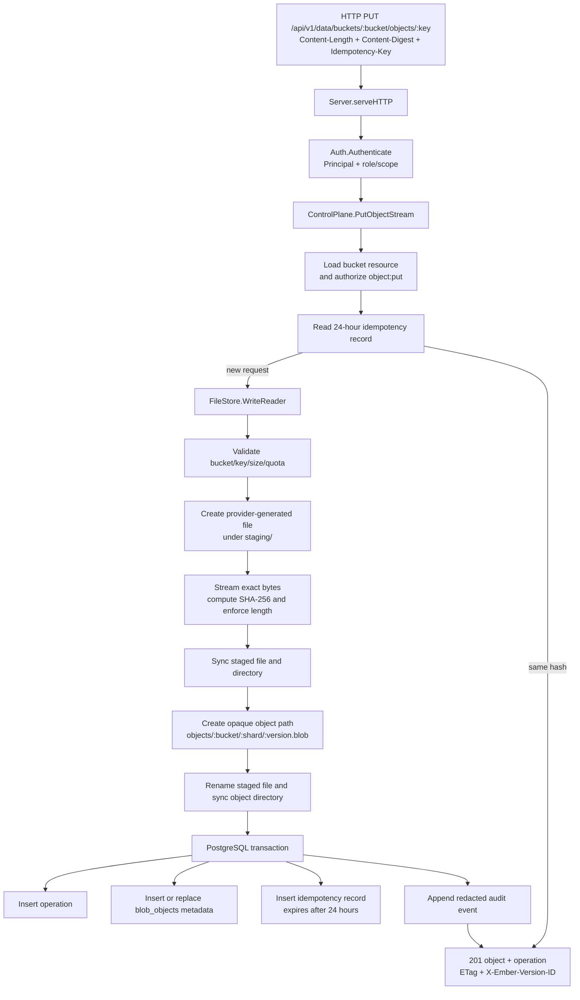
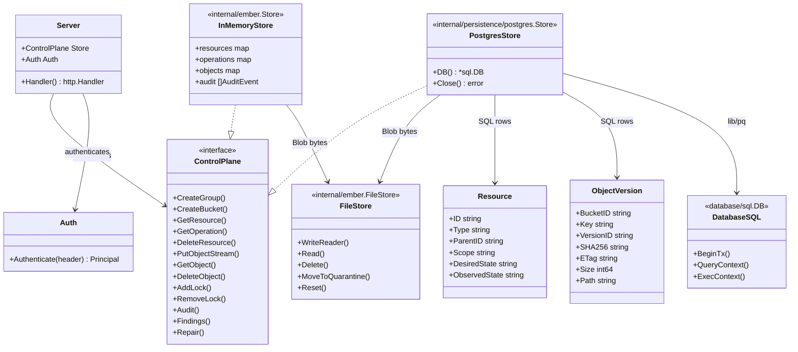
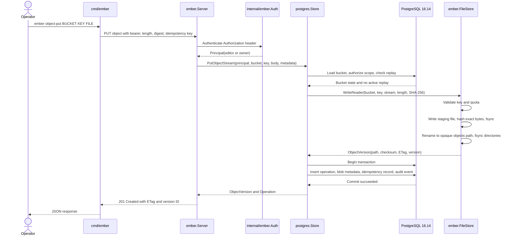

# Ember Phase 1 design

This document describes the implementation currently in this repository. It is intentionally limited to the verified Phase 1 boundary: an HTTP API and CLI over a Go control-plane interface, PostgreSQL 16.14 for authoritative resource/operation state, and an Ember-owned local filesystem provider for Blob bytes.

The API is Azure-shaped rather than Azure-compatible. The diagrams show both the production PostgreSQL adapter and the explicit in-memory adapter used by deterministic local contract tests.

## 1. High-level design (HLD)

## 2. Low-level object write path (LLD)

The filesystem provider commits bytes before the metadata transaction. A failed or invalid write is removed or recorded as a repair finding by the current implementation; reads verify the stored SHA-256 before returning bytes. PostgreSQL startup applies the embedded migration and refuses incompatible schema metadata.

## 3. Classes, interfaces, and dependencies

## 4. Sequence: PostgreSQL-backed object PUT

### Deliberate non-goals

This Phase 1 design does not include a distributed control plane, cloud deployment, asynchronous object transfer, public authentication, Azure wire compatibility, or later Ember services. Those would require a new reviewed boundary rather than being inferred from these diagrams.
