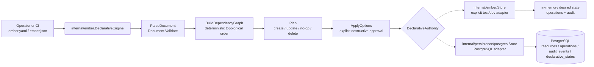
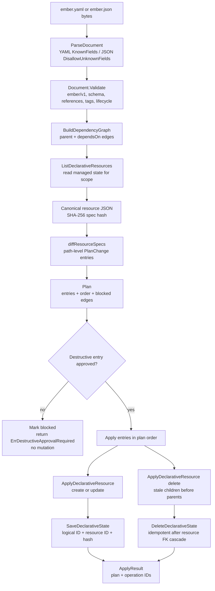
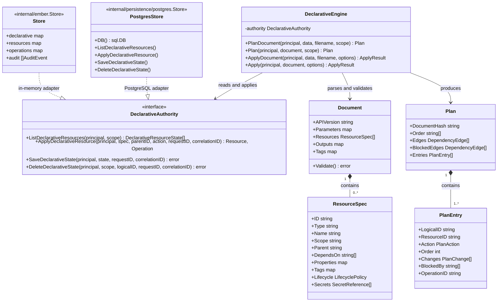
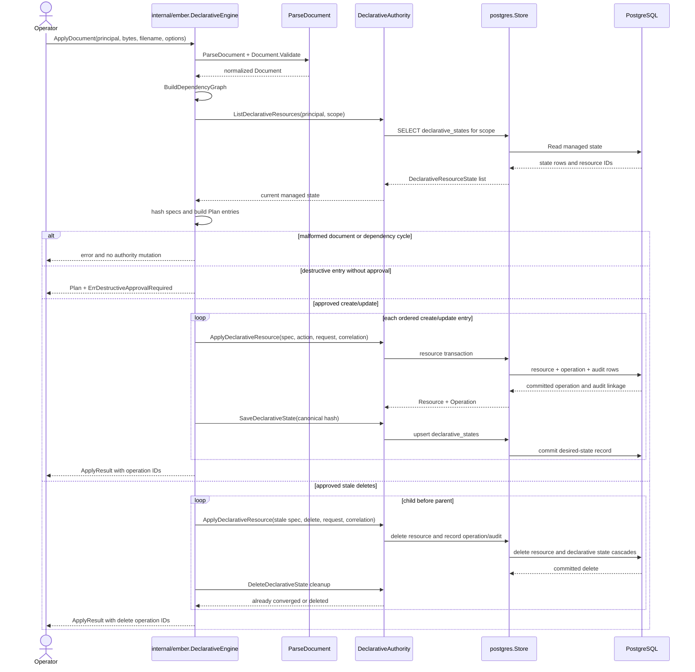

# Ember Phase 2 design — declarative deployment engine

This document describes the Phase 2 implementation in this repository. It adds a
small, versioned `ember/v1` declarative contract for `ember.yaml` and `ember.json`,
a deterministic dependency graph, previewable plan entries, and an apply path over
the existing in-memory and PostgreSQL authorities. The engine owns desired-state
comparison; the existing resource, operation, audit, and authorization boundaries
remain authoritative for mutations.

The format is Ember-owned and intentionally not a Bicep or Azure compatibility
claim. Phase 2 supports `resourceGroup` and `Ember.Blob/bucket` resources, parameters,
tags, outputs, lifecycle policy, and secret references. Secret values are not
resolved by this engine. Plan changes and persisted per-resource `SpecJSON`
apply a bounded redaction policy: secret-reference names/keys and values below
secret-, key-, password-, token-, credential-, authorization-, and private-key-
like property names are replaced with `[REDACTED]`. This is not arbitrary secret
storage: values under names outside that policy can still be retained, so
callers must use `secretRefs` and avoid inline secrets.

## HLD — high-level design

The engine reads the current managed state through `DeclarativeAuthority`, computes
an order-stable plan, and refuses malformed documents, unknown dependencies, and
cycles before any authority mutation. Apply skips converged entries, executes
creates and updates in dependency order, and executes stale deletes from children
to parents. Destructive updates and deletes require `ApproveDestructive`; a blocked
apply returns its preview and performs no destructive mutation.

## LLD — low-level execution flow

`Plan.Order` and every `PlanEntry.Order` expose the execution order. Parent and
explicit dependency edges are normalized and sorted before the topological pass.
For stale resources, persisted `ParentID` values provide a deterministic
child-before-parent deletion order. The PostgreSQL declarative row is linked to the
resource by a foreign key; cleanup therefore treats a row already removed by the
successful resource deletion as converged.

## Secret handling boundary

The declarative input can carry arbitrary `ResourceSpec.Properties` values for
provider-facing resource configuration, so the document model is not a general
secret vault. The engine does not resolve secret references or promise that an
arbitrary property name is safe. Before a plan change is emitted or declarative
state is persisted, the bounded policy below replaces values with `[REDACTED]`:

- `secretRefs` retain their array/object shape, but each reference `name` and
  `key` is redacted;
- property/path names containing or equal to `secret`, `key`, `password`,
  `token`, `credential`, `authorization`, `bearer`, `connectionString`, or
  private-/API-/access-key-like names are redacted, including nested values;
- malformed persisted state fails closed with an input-safe error instead of being
  copied into a plan change;

The full canonical resource JSON is used only to calculate the convergence hash;
the persisted `SpecJSON` is the redacted, shape-preserving form. Callers must use
`secretRefs` and avoid inline secrets; values under names outside this bounded
policy can still be retained.

## Class/interface — authority and plan contracts

The interface keeps desired-state orchestration independent from persistence. Both
adapters return the existing `Resource` and `Operation` contracts, while the
engine records each managed logical ID with its canonical spec hash. Operation IDs
and correlation IDs returned by an apply are the linkage used to inspect the
existing operation and audit records.

## Sequence — PostgreSQL-backed plan/apply

## Scope and non-goals

Phase 2 does not add a new HTTP or CLI surface, a new provider, automatic secret
resolution, rollback orchestration, or implicit approval. It provides the
versioned engine and persistence contract used by the existing Ember control-plane
code. Public deployment, paid resources, and Azure/Bicep compatibility remain
outside this issue.
